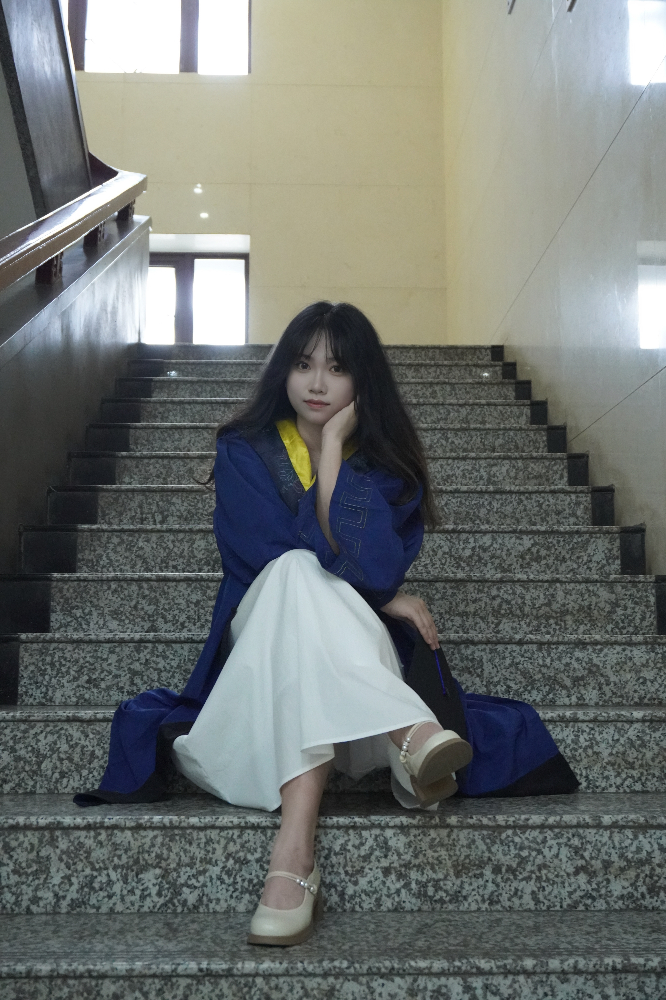

# About Me

Here is **Jiayi Wu (Justina, 吴佳怡)**. 

I am a Software Engineer(Backend) at **Tencent**, working on backend development for enterprise-scale data management platforms. I received my M.Eng. in Electronic Information from **Xidian University**, where I conducted research in privacy-preserving machine learning, personalized federated learning, and secure collaborative systems. Prior to that, I earned a dual bachelor's degree in Electronic Information Science and Technology from **Northwest University** (China) and Electronic Systems Engineering from the **University of Essex** (UK).

I am interested in building scalable and privacy-preserving data-intensive systems by integrating machine learning, distributed systems, and data management.

If you are interested in any aspect of me, I am always open to discussions and collaborations. Feel free to reach out to me at - justinawjy@gmail.com or justina_wu@163.com.

<!-- **I am currently seeking Ph.D. opportunities for 2027 in privacy-preserving, privacy-preserving machine learning, and related areas. If you think my background could be a good fit for your research group, I would be happy to get in touch.** -->

---

## Research Interests

- Privacy Preserving
- Federated Learning
- Information Security
- Deep Learning

My current research focuses on Federated Learning and privacy preservation, focusing on exploring privacy protection methods in Personalized Federated Learning scenarios. At the same time, I am interested in information security, machine learning and applications, fairness and other fields.

---

## News and Updates

- 2023.06 Selected as a **graduate representative** to give a speech at the graduation ceremony!

 
